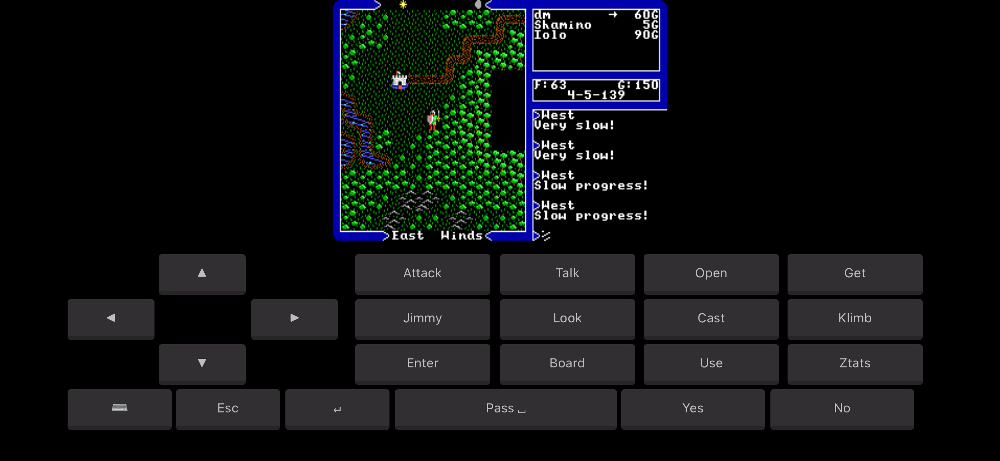
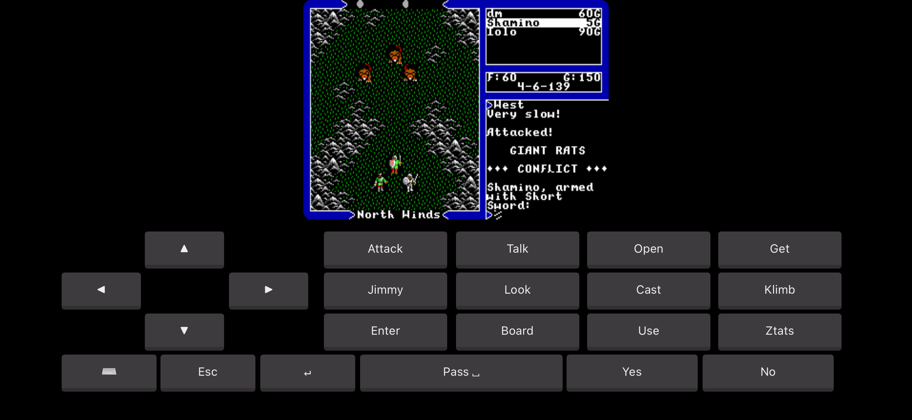
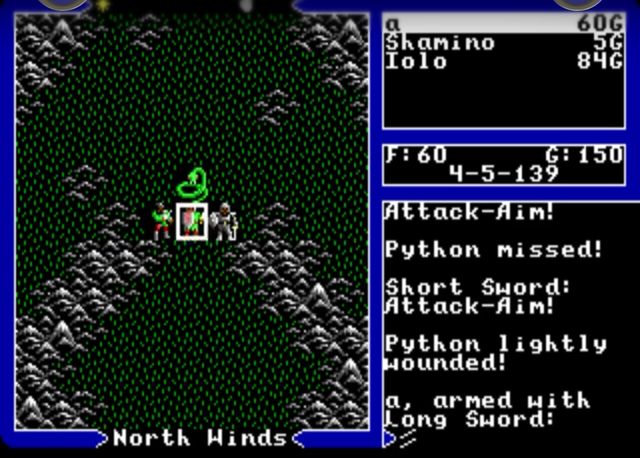

# Ultima V on iOS

**Play Ultima V: Warriors of Destiny on your iPhone or iPad** — the complete, original
DOS game, running in DOSBox, booting straight into the game with a gold-ankh icon.

It's built on [dospad](https://github.com/litchie/dospad) (the open-source iOS DOSBox,
GPLv2), cloned and patched at build time, plus **your own** copy of Ultima V.

> **You must own Ultima V.** It isn't free, so **no game data is included in this repo** —
> the build copies your own copy onto the device. The DOSBox app is cloned + patched at
> build time, not re-hosted here.

## 📸 Screenshots

The real Ultima V running in DOSBox on an iPhone — exploring Britannia and doing battle,
with the on-screen D-pad and command buttons:

<p align="center">
  
  &nbsp;&nbsp;
  
</p>

<p align="center">
  
</p>

## 🚀 Install

Requires a **Mac** with **Xcode** and **git** (no Mac? see [💻 No Mac?](#-no-mac-sideload-the-prebuilt-app) below). **No paid Apple Developer account ($99/yr)
is needed** — see [💸 No paid Apple account needed](#-no-paid-apple-account-needed) below.

**On your iPhone/iPad** (needs just a free Apple ID — one command):

```sh
git clone https://github.com/dmaynard51/ultima5-ios.git
cd ultima5-ios
dosbox/build-ios-dosbox.sh
```

That's it — it auto-detects your Apple Team ID, clones the iOS DOSBox, patches it to
auto-run Ultima V, brands it with the ankh icon and the name "Ultima V", **strips the
extra app-extension so a free Apple ID has just one target to sign**, builds, signs,
installs, and copies your game data onto the device. It boots straight into the game with
an on-screen D-pad + Ultima command keyboard and sound. First run on the phone: **trust
the app once** under **Settings ▸ General ▸ VPN & Device Management**, then reopen.

If auto-detect can't find your team, pass your 10-char Team ID as the first argument
(`security find-identity -v -p codesigning` — the code in parentheses):

```sh
dosbox/build-ios-dosbox.sh ABCDE12345
```

By default it reads your U5 data from `/Applications/Ultima V™.app/Contents/Resources/game`
(a Mac GOG install). If yours is elsewhere, pass the folder (the one with `ULTIMA.EXE`
+ `TILES.16`) as the last argument:

```sh
dosbox/build-ios-dosbox.sh ABCDE12345 "/path/to/your/ultimaV/game"
```

> **Hit a "$99 / register a device" wall in Xcode?** You don't need the paid program —
> that's just the command-line signer failing on a free account. See
> [💸 No paid Apple account needed](#-no-paid-apple-account-needed) below; the script now
> prints the exact free Xcode steps if CLI signing fails.

## 💸 No paid Apple account needed

**You do _not_ need the $99/year Apple Developer Program.** Installing an app you built
onto **your own** device is free with any Apple ID — this is Apple's "free provisioning."
If Xcode ever pushes you toward a paid membership to *"register a device,"* that's the
**command-line** signing path failing on a free account, **not** a real requirement: a
free Apple ID can't mint provisioning profiles from the terminal, only through the Xcode
app. Do the signing once in the **Xcode GUI** and it's completely free:

1. Run the build script once — it still clones + patches DOSBox even if signing fails
   (or just `git clone https://github.com/litchie/dospad.git`).
2. Open the project in Xcode:
   `~/Library/Caches/u5-dosbox/dospad/dospad.xcodeproj`
3. **Xcode ▸ Settings ▸ Accounts** → add your **free Apple ID**.
4. In **Signing & Capabilities** for the **iDOS** target, set **Team** to your *Personal
   Team* and give it a **unique Bundle Identifier** (e.g. `com.yourname.u5dos`). *(The
   build script removes dospad's Thumbnail app-extension by default, so there's only this
   one target to sign — the usual free-account snag. Pass `U5DOS_KEEP_THUMBNAIL=1` to keep
   it if you have a paid account.)*
5. Plug in your iPhone/iPad (unlocked, **Developer Mode on**) and press **Run ▶**. Xcode
   registers the device **for free** and installs the app.
6. On the device, trust the certificate under **Settings ▸ General ▸ VPN & Device
   Management**, then reopen — it boots straight into Ultima V.

> ⚠️ **The one real catch with a free Apple ID:** the app's signature **expires after 7
> days** — just press **Run ▶** again to re-install and renew it. (A paid account lasts a
> year; that's the only difference that matters here.) Free accounts are also capped at 3
> sideloaded apps at a time.

**Don't want to re-sign weekly?** Sideload with **[AltStore](https://altstore.io)** or
**[SideStore](https://sidestore.io)** — they sign with your free Apple ID and
auto-refresh the 7-day certificate in the background, no Mac needed after setup.

## 💻 No Mac? (sideload the prebuilt app)

No Mac or Xcode? Download the prebuilt **[Ultima V IPA](https://github.com/dmaynard51/ultima5-ios/releases/latest)** and sideload it from a
**Windows or Linux PC** — no Mac needed:

- **[Sideloadly](https://sideloadly.io)** or **[AltStore](https://altstore.io)** install the
  `.ipa` with a **free Apple ID** (AltStore auto-refreshes the 7-day signature over Wi-Fi).
- **No computer at all:** **TrollStore** installs it permanently *if* your iOS supports it;
  in the EU, **AltStore PAL**.

The IPA has **no game data**. After installing, open the **Files** app → **On My iPhone →
Ultima V** and copy your own Ultima V DOS game files into that folder's root, then reopen the
app — it boots straight into the game.

## 🎮 Playing

The app runs in **landscape** and gives you a purpose-built Ultima control layout (no
fiddly DOS keyboard or toolbar):

- a **movement D-pad** on the left,
- the frequent **U5 commands** as labelled buttons — Attack, Talk, Open, Get, Jimmy,
  Look, Cast, Klimb, Enter, Board, Use, Ztats,
- a utility row: **⌨** (full keyboard), **Esc**, **↵**, **Pass**, **Yes**, **No**.

The game screen sits above the controls (nothing is covered), and there's **sound**. When
you need to type — NPC conversation keywords, quantities, your character's name — tap **⌨**
for a full QWERTY, and **⌨▸CMDS** flips back to the command pad.

## ☕ Support this port

Getting Ultima V running one-tap on your phone — the DOSBox patching, the ankh icon,
the auto-boot, and keeping it working — takes real time. If it let you play U5 on your
phone and you'd like to say thanks, a coffee is hugely appreciated (and optional):

- ☕ **[Buy me a coffee (Ko-fi)](https://ko-fi.com/dmaynard)**
- 💜 **[GitHub Sponsors](https://github.com/sponsors/dmaynard51)**

## 🙏 Credits & license

- iOS DOSBox: **[dospad](https://github.com/litchie/dospad)** by litchie (GPLv2) —
  cloned + patched at build time.
- Ankh app icon and the build script: MIT — see [LICENSE](LICENSE).
- *Ultima V* and its data are © Origin Systems / Electronic Arts. This project ships
  none of it; you bring your own legally-owned copy.
